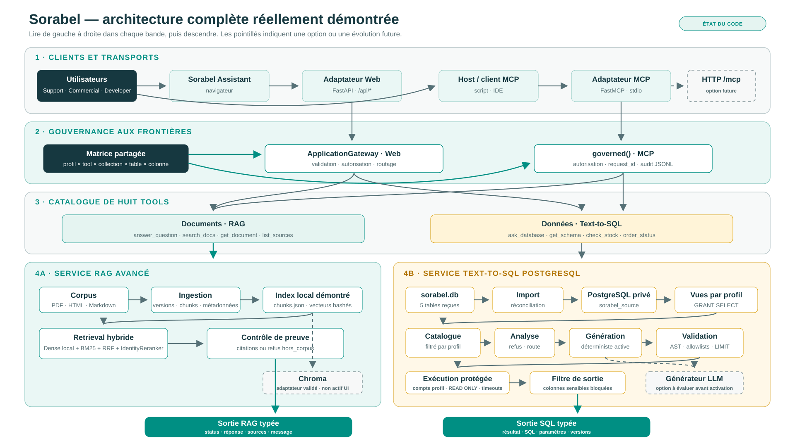

# Architecture complète Sorabel — état réellement démontré

Téléchargements pour la présentation :

- [source Mermaid modifiable](diagrams/08-architecture-complete-sorabel.mmd) ;
- [SVG net et zoomable](diagrams/08-architecture-complete-sorabel.svg) ;
- [PNG 1920 × 1080](diagrams/08-architecture-complete-sorabel.png).

## Comment lire le schéma

Le schéma se lit **de gauche à droite dans une bande, puis de haut en bas**.

1. La première bande montre qui appelle le système et par quel transport.
2. La deuxième montre où les autorisations sont appliquées.
3. La troisième montre les huit tools exposés.
4. La quatrième sépare les deux moteurs métier : RAG et Text-to-SQL.
5. Les deux sorties du bas montrent les contrats renvoyés aux clients.

Un trait plein représente le chemin réellement utilisé. Un trait pointillé représente une option
présente dans le code ou une évolution future qui n’est pas annoncée comme terminée.

## 1. Deux entrées, pas deux systèmes métier

L’interface **Sorabel Assistant** appelle les routes FastAPI `/api/answer`, `/api/search`,
`/api/database` et `/api/schema`. FastAPI adapte les requêtes HTTP au
`ApplicationGateway`.

Le client MCP lance séparément le serveur FastMCP en transport `stdio`. Il n’existe donc pas encore
de route HTTP `/mcp` dans le chemin démontré. Une telle route est possible plus tard avec un
transport MCP HTTP, sans être une propriété obligatoire de MCP.

Preuves :

- [`web_app/server.py`](../../../web_app/server.py) — routes Web et construction du Gateway ;
- [`application/gateway.py`](../../../application/gateway.py) — entrée indépendante du protocole ;
- [`mcp_server/server.py`](../../../mcp_server/server.py) — huit tools et transport `stdio` ;
- [`scripts/mcp_client.py`](../../../scripts/mcp_client.py) — client MCP de démonstration.

## 2. Une matrice partagée, deux adaptateurs d’entrée

La constante `TOOLS_BY_PROFILE` est la source commune pour les droits par profil. Le Web
l’applique dans `ApplicationGateway`. Le serveur MCP la réutilise dans `governed()`, qui ajoute un
`request_id` et écrit l’audit JSONL. Cela ne signifie pas que les deux adaptateurs s’appellent entre
eux : ils convergent vers les mêmes services métier.

Preuves :

- [`application/gateway.py`](../../../application/gateway.py) — matrice et autorisation Web ;
- [`mcp_server/server.py`](../../../mcp_server/server.py) — autorisation et audit MCP ;
- [`conception/05-matrice-acces.md`](../conception/05-matrice-acces.md) — matrice complète profil ×
  tool × collection × table/colonne.

## 3. Huit tools, deux familles

Les quatre tools documentaires sont `answer_question`, `search_docs`, `get_document` et
`list_sources`. Les quatre tools SQL sont `ask_database`, `get_schema`, `check_stock` et
`order_status`.

Le client ou l’agent choisit le tool correspondant au besoin. La Gateway ne choisit pas à sa place :
elle vérifie que l’appel est autorisé avant de le router.

Preuve : [`mcp_server/server.py`](../../../mcp_server/server.py).

## 4A. Branche RAG réellement utilisée

Le corpus PDF, HTML et Markdown est normalisé, versionné puis découpé en chunks avec
métadonnées. La démonstration utilise ensuite l’index local reproductible, une recherche dense
locale, BM25, une fusion RRF et un reranking lexical deterministe (`LexicalReranker`). Le service répond avec des citations ou renvoie
`hors_corpus` lorsque la preuve est insuffisante.

`ChromaVectorStore` existe et possède ses tests d’intégration, mais il ne constitue pas le chemin
actif du Sorabel Assistant. Le schéma le place donc en pointillés.

Preuves :

- [`ingest/pipeline.py`](../../../ingest/pipeline.py) — ingestion et manifeste ;
- [`retrieval/dense.py`](../../../retrieval/dense.py) — index dense local actif ;
- [`retrieval/lexical.py`](../../../retrieval/lexical.py) — BM25 ;
- [`retrieval/fusion.py`](../../../retrieval/fusion.py) — RRF ;
- [`retrieval/service.py`](../../../retrieval/service.py) — orchestration, profils, preuve et refus ;
- [`ingest/chroma_store.py`](../../../ingest/chroma_store.py) — adaptateur Chroma disponible.

## 4B. Branche Text-to-SQL réellement utilisée

La base SQLite reçue sert de source reproductible. Le script de préparation importe et réconcilie
les cinq tables dans PostgreSQL. Les migrations créent ensuite le schéma privé, les vues Support et
Commercial, puis les rôles limités par `GRANT SELECT`.

Pour `ask_database`, le service charge le catalogue filtré du profil, analyse la question, produit
une proposition SQL, valide son AST et ses ressources, puis exécute avec le compte PostgreSQL du
profil dans une transaction `READ ONLY` avec timeouts. Un dernier contrôle empêche une colonne
sensible de sortir pour Support.

Le générateur déterministe est le chemin actif de la démonstration. L’adaptateur LLM compatible
OpenAI est disponible, mais doit être évalué avant activation. MCP n’impose donc aucun LLM côté
serveur : c’est un choix du tool `ask_database`, pas une propriété du protocole.

Preuves :

- [`scripts/setup_postgres.py`](../../../scripts/setup_postgres.py) — import et réconciliation ;
- [`sql/migrations/`](../../../sql/migrations/) — SQL versionné ;
- [`sql/semantic_catalog.json`](../../../sql/semantic_catalog.json) — définitions et versions ;
- [`sql/catalog.py`](../../../sql/catalog.py) — contexte filtré ;
- [`sql/analyzer.py`](../../../sql/analyzer.py) — refus, clarification et routage ;
- [`sql/generator.py`](../../../sql/generator.py) — générateur actif et adaptateur optionnel ;
- [`sql/validator.py`](../../../sql/validator.py) — AST, allowlists et limites ;
- [`sql/executors.py`](../../../sql/executors.py) — comptes, `READ ONLY` et timeouts ;
- [`sql/service.py`](../../../sql/service.py) — orchestration et filtre de sortie.

## 5. Sorties et preuves

Une réponse RAG transporte son statut, son contenu et ses sources. Une réponse SQL transporte son
statut, les lignes, le SQL, les paramètres et les versions de données, schéma et politique. Une
erreur typée reste une erreur ; le client ne doit jamais la présenter comme une réponse métier.

Preuves :

- [`tests/acceptance/test_rag.py`](../../../tests/acceptance/test_rag.py) ;
- [`tests/acceptance/test_sql.py`](../../../tests/acceptance/test_sql.py) ;
- [`tests/acceptance/test_mcp.py`](../../../tests/acceptance/test_mcp.py) ;
- [`evidence/postgresql-reconciliation.json`](../evidence/postgresql-reconciliation.json) ;
- [`evidence/postgresql-privileges.json`](../evidence/postgresql-privileges.json) ;
- [`eval/rapport_gain.md`](../../../eval/rapport_gain.md) ;
- [`eval/rapport_sql.md`](../../../eval/rapport_sql.md).

## Phrase à retenir

> Le client choisit un tool ; la frontière d’entrée autorise l’appel ; le service applique le
> périmètre des données ; la base exécute en lecture seule ; la sortie apporte la preuve.
