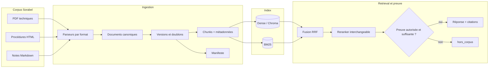
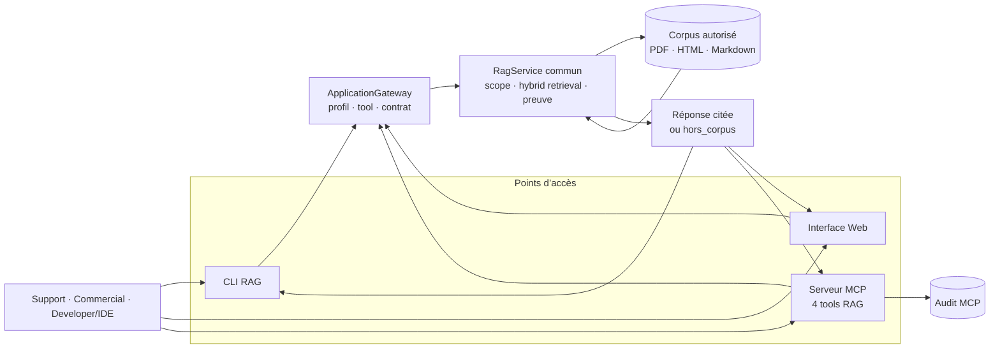

# Architecture d’implémentation du RAG avancé

Ce document décrit le RAG réellement intégré dans Sorabel. Les sources Mermaid modifiables et
zoomables sont dans [`diagrams/`](diagrams/).

## 1. Pipeline RAG

Les formats changent, mais le contrat canonique reste identique. Chaque chunk conserve le titre,
la référence, la version, la date, le type documentaire et la collection. Dense traite la
formulation naturelle, BM25 renforce les termes exacts comme `REF-8842`, RRF fusionne les rangs,
puis le contrôle de preuve choisit entre réponse citée et refus.

## 2. Intégration dans la Gateway

Le terminal, l’interface Web et les quatre tools MCP réutilisent le même `RagService`. Le profil
limite les collections avant la recherche. La logique de citations et de refus n’est donc pas
dupliquée selon le client.

## Code et preuves

| Responsabilité | Code | Preuve |
|---|---|---|
| parsing et contrat canonique | `ingest/parsers.py`, `ingest/models.py` | tests unitaires |
| versions et doublons | `ingest/catalog.py` | manifeste d’ingestion |
| chunks et indexation | `ingest/chunking.py`, `ingest/pipeline.py` | `docs/livrable/evidence/ingestion-manifest.json` |
| dense, BM25 et RRF | `retrieval/dense.py`, `lexical.py`, `fusion.py` | `eval/rapport_gain.md` |
| scope, preuve et citations | `retrieval/service.py` | `tests/acceptance/test_rag.py` |
| CLI, Web et MCP | `scripts/rag_cli.py`, `web_app/`, `mcp_server/server.py` | tests d’intégration et acceptance |

Le chemin vérifié utilise l’embedder local déterministe et `IdentityReranker`. Les adaptateurs
Sentence Transformer et Cross Encoder existent comme extensions, mais aucun gain ne leur est
attribué sans mesure dédiée.
