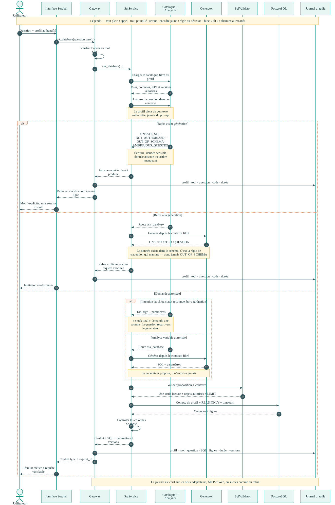
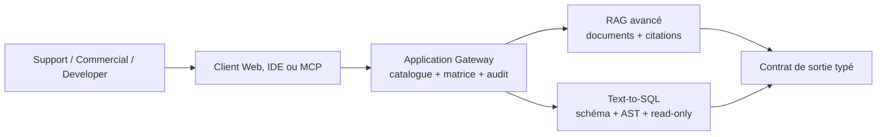
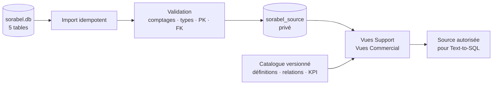
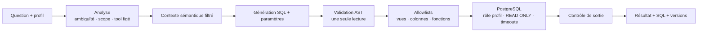
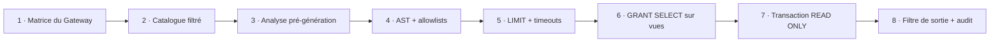
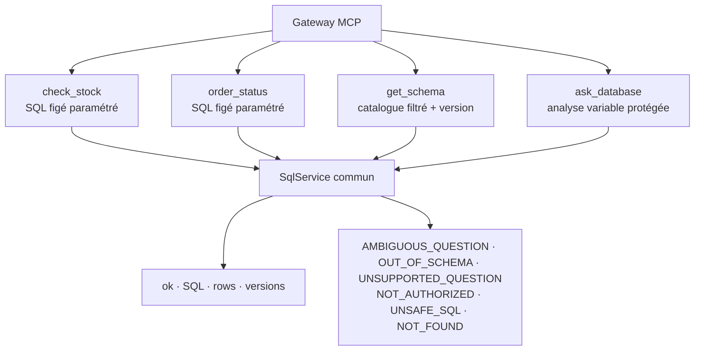

# Architecture d’implémentation Text-to-SQL PostgreSQL

Ce document explique le Text-to-SQL réellement implémenté dans Sorabel.  `docs/livrable/architecture/diagrams/`.

### Architecture centrée sur le service SQL

Cette vue place les quatre tools autour du `SqlService`. La Gateway est seulement la frontière
d’accès. Le centre du chantier est bien Text-to-SQL : catalogue filtré, trois routes, validation,
exécution PostgreSQL et contrôle de sortie.

**Légende** — chaque couleur est une branche de premier niveau, lue du centre vers l’extérieur :

| Branche | Ce qu’elle regroupe |
|---|---|
| **Entrée et accès** | interface ou CLI, profil authentifié, vérifications de la Gateway |
| **Quatre tools SQL** | `get_schema`, `check_stock`, `order_status`, `ask_database` |
| **Trois routes** | catalogue seul · requête figée · analyse variable |
| **Source sémantique** | `sorabel.db`, PostgreSQL privé, catalogue versionné |
| **Défense en profondeur** | contexte filtré, AST, allowlists, `READ ONLY`, timeouts, filtre de sortie |
| **Contrat de réponse** | résultat, SQL, paramètres, versions, six erreurs typées |
| **Journal d’audit** | succès et refus, question et SQL, durée, deux canaux |
| **Mesure du chantier** | 27/27, exactitude 14/14, **230 tests** (suite complète du dépôt), limites nommées |

### Séquence détaillée de `ask_database`

Cette vue se lit de haut en bas. Elle montre précisément où un refus s’arrête et pourquoi le
générateur ne constitue jamais une autorité de sécurité. Trois sorties sont distinguées : refus
avant génération, refus à la génération (`UNSUPPORTED_QUESTION`) et demande autorisée. Chacune
est écrite au journal d’audit.

**Légende** — elle figure aussi en haut de l’image :

| Élément visuel | Signification |
|---|---|
| trait plein `→` | un appel : un composant en sollicite un autre |
| trait pointillé `⇢` | un retour : la réponse remonte |
| encadré jaune | une règle ou une décision à retenir |
| bloc `alt` | des chemins alternatifs, un seul est emprunté |
| colonne verticale | la durée de vie d’un composant pendant l’appel |

### Architecture technique d’exécution

Cette troisième vue répond à une question que les deux précédentes laissent ouverte : **où est-ce
dans le code ?** Elle ne contient que des éléments vérifiables — chemins de fichiers, routes HTTP,
transport MCP, taille du pool de connexions, délais d’expiration, nom du conteneur, port, rôles
PostgreSQL et numéros de migration.

**Légende** — elle figure aussi dans l’image, en bas :

| Couleur | Famille | Ce qu’elle regroupe |
|---|---|---|
| 🟡 jaune | **Entrée et accès** | navigateur, hôte MCP, `web_app/server.py`, `mcp_server/server.py` |
| 🟢 vert | **Cœur applicatif** | `application/gateway.py`, `sql/service.py`, `sql/catalog.py`, service RAG |
| 🟠 orange | **Contrôles** | `analyzer.py`, `generator.py`, `validator.py`, `executors.py`, `audit.py` |
| 🔵 bleu | **Données** | schémas PostgreSQL, vues, rôles, index Chroma |

| Niveau | Vue | Question à laquelle elle répond |
|---|---|---|
| Conceptuel | 09 — mindmap | Quel est le périmètre du chantier ? |
| Dynamique | 10 — séquence | Que se passe-t-il pour une question donnée ? |
| Technique | 11 — exécution | Où est-ce implémenté, et avec quels réglages ? |

## 1. Position dans le système complet

Le client ne dialogue jamais directement avec PostgreSQL. Il appelle un tool via la Gateway. La
Gateway vérifie le profil et route la demande vers le service SQL. RAG et Text-to-SQL restent deux
services distincts derrière la même frontière MCP.

## 2. Construction de la source sémantique fiable

SQLite reste la source reçue et l’oracle reproductible. Les cinq tables sont importées dans un
schéma PostgreSQL privé. Les vues métier sont ensuite publiées par profil avec un catalogue
sémantique versionné. Le modèle ne reçoit jamais le schéma brut.

## 3. Chemin d’une question variable

Le générateur propose une requête, mais ne l’autorise jamais. L’AST résout les objets réellement
lus, les allowlists comparent ces objets au contexte du profil, puis PostgreSQL exécute dans une
transaction `READ ONLY`. Le résultat et la requête sont renvoyés ensemble.

## 4. Défense en profondeur

Les barrières sont indépendantes. Une erreur du générateur ne suffit pas à obtenir un accès : le
validateur, les privilèges PostgreSQL, la transaction et le contrôle de sortie restent actifs.

Pour Support, `prix_achat_ht`, `marge_pct`, `marge_ht` et la source `ventes` sont absents du
catalogue, absents des vues autorisées et bloqués avant la sortie.

## 5. Quatre tools SQL, un seul service

`check_stock` et `order_status` utilisent des requêtes paramétrées connues. `get_schema` expose le
catalogue visible sans exécuter de données. `ask_database` traite les analyses variables. Tous
réutilisent le même catalogue, les mêmes rôles, le même exécuteur et les mêmes erreurs typées.

## 6. Du label au code — navigation en direct

Chaque lien ouvre le fichier **à la ligne exacte**. Numéros vérifiés le 2026-09-03.

### Entrée et contrôle d'accès

| Ce qu'on montre | Ouvrir |
|---|---|
| Les quatre routes HTTP de l'interface | [`web_app/server.py:87`](../../../web_app/server.py#L87) |
| Le serveur MCP et son enveloppe gouvernée | [`mcp_server/server.py:60`](../../../mcp_server/server.py#L60) |
| **La matrice profil × tool** | [`application/gateway.py:42`](../../../application/gateway.py#L42) |
| La seule fonction qui lit la matrice | [`application/gateway.py:57`](../../../application/gateway.py#L57) |
| Le journal, appelé sur succès **et** refus | [`application/gateway.py:81`](../../../application/gateway.py#L81) |
| Le module de journal partagé | [`application/audit.py:46`](../../../application/audit.py#L46) |

### Décision, génération, validation

| Ce qu'on montre | Ouvrir |
|---|---|
| **Le catalogue filtré par profil** | [`sql/catalog.py:22`](../../../sql/catalog.py#L22) |
| Les quatre refus avant génération | [`sql/analyzer.py:78`](../../../sql/analyzer.py#L78) |
| La règle d'agrégation — « stock **total** » | [`sql/analyzer.py:104`](../../../sql/analyzer.py#L104) |
| Le générateur déterministe — **repli hors ligne**, plus actif | [`sql/generator.py:71`](../../../sql/generator.py#L71) |
| **Le générateur agentique — ACTIF depuis le 04/09** | [`sql/generator.py:289`](../../../sql/generator.py#L289) |
| **`UNSUPPORTED_QUESTION`**, distinct de `OUT_OF_SCHEMA` | [`sql/generator.py:409`](../../../sql/generator.py#L409) |
| La bascule `SORABEL_SQL_GENERATOR` | [`sql/generator.py:415`](../../../sql/generator.py#L415) |
| Les dix fonctions SQL autorisées | [`sql/validator.py:16`](../../../sql/validator.py#L16) |
| **Les six contrôles de l'AST** | [`sql/validator.py:166`](../../../sql/validator.py#L166) |

### Exécution et contrat

| Ce qu'on montre | Ouvrir |
|---|---|
| Le pool borné, `min 0 max 4` | [`sql/executors.py:48`](../../../sql/executors.py#L48) |
| **`SET TRANSACTION READ ONLY` + timeouts** | [`sql/executors.py:51`](../../../sql/executors.py#L51) |
| Un compte PostgreSQL par profil | [`sql/executors.py:138`](../../../sql/executors.py#L138) |
| Les six codes d'erreur typés | [`sql/errors.py:6`](../../../sql/errors.py#L6) |
| L'orchestration des quatre tools | [`sql/service.py:139`](../../../sql/service.py#L139) |

> 💡 Dans VS Code, `Ctrl + G` puis le numéro amène directement à la ligne si un lien ne s'ouvre
> pas. Les lignes 104 et 227 pointent volontairement sur le **commentaire** qui précède le code :
> il explique le pourquoi avant le comment.

### Les trois lignes décisives

Si le temps manque, ces trois lignes suffisent à raconter le chantier.

| Ligne | Fichier | Ce qu'elle prouve |
|---|---|---|
| **54** | [`sql/executors.py`](../../../sql/executors.py#L54) | `SET TRANSACTION READ ONLY` — la base elle-même refuse d'écrire, indépendamment du code applicatif. |
| **86** | [`sql/analyzer.py`](../../../sql/analyzer.py#L86) | le refus d'écriture passe **avant** tout le reste : aucune requête n'est produite. |
| **231** | [`sql/generator.py`](../../../sql/generator.py#L231) | `UNSUPPORTED_QUESTION` : la limite du générateur est nommée, pas déguisée en absence de donnée. |

---

## Preuves exécutables

- `docs/livrable/evidence/postgresql-reconciliation.json` : cinq tables réconciliées ;
- `docs/livrable/evidence/postgresql-privileges.json` : contrôles de privilèges PostgreSQL ;
- `eval/rapport_sql.md` : **27 cas sur 27**, dont **14 exactitudes métier sur 14** comparées à
  une vérité terrain calculée séparément sur `sorabel_source` ;
- `tests/acceptance/test_sql.py` : les quatre exigences Text-to-SQL du brief ;
- `tests/acceptance/test_mcp.py` : exposition, matrice et journal ;
- `tests/unit/test_gateway_journal.py` : le refus est journalisé aussi sur le chemin Web ;
- `docs/livrable/GUIDE-DEMONSTRATION.md` : le déroulé rejouable des 26 questions ;
- `docs/livrable/evidence/demonstration-web.json` : les 26 cas passés par l’interface Web,
  avec statut, code d’erreur, backend et valeur renvoyée ;
- suite complète mesurée le 2026-09-07 : **230 tests réussis** ;
- générateur SQL actif : **agentique**, `gpt-5.4` via Azure AI Foundry. Le modèle reçoit le
  seul schéma autorisé au profil et n'a aucune capacité d'appel d'outil — la requête envoyée
  ne contient pas de champ `tools`. Le déterministe reste le repli hors ligne.

La source PostgreSQL de démonstration est le service Compose `postgres`, exposé localement sur le
port `55432`. Les secrets restent exclusivement dans `.env`, qui n’est pas versionné.
