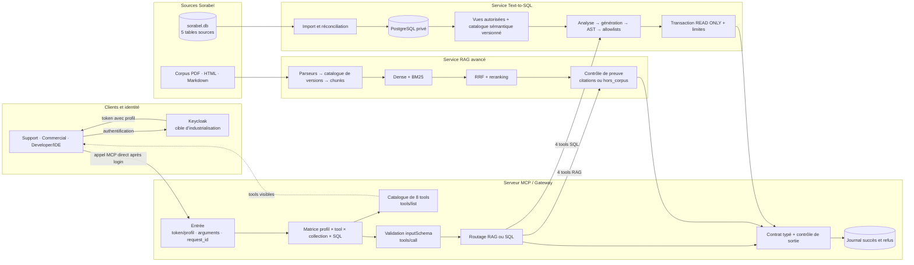

# 1 — Schéma du flux complet

## Architecture logique

## Lecture

Le corpus documentaire et la base SQL restent deux sources différentes. Le RAG transforme les
documents en chunks recherchables et refuse sans preuve. Le Text-to-SQL importe les cinq tables
dans PostgreSQL, expose des vues sémantiques autorisées et n’exécute que du SQL validé en lecture
seule. Après authentification, le client appelle directement le serveur MCP avec son identité. La
Gateway ne remplace aucun moteur : elle expose les tools, applique la matrice à chaque requête,
valide les arguments, route l’appel, contrôle la réponse et journalise chaque décision.

## Correspondance avec le code

| Bloc | Code principal | Preuve |
|---|---|---|
| ingestion documentaire | `ingest/parsers.py`, `catalog.py`, `chunking.py`, `pipeline.py` | `data/index/manifest.json` |
| retrieval hybride | `retrieval/dense.py`, `lexical.py`, `fusion.py`, `service.py` | `eval/rapport_gain.md` |
| préparation SQL | `scripts/setup_postgres.py`, `sql/migrations/` | preuves PostgreSQL dans `docs/livrable/evidence/` |
| validation et exécution SQL | `sql/analyzer.py`, `generator.py`, `validator.py`, `executors.py`, `service.py` | `eval/rapport_sql.md` |
| gouvernance commune | `application/gateway.py`, `mcp_server/server.py` | `tests/acceptance/test_mcp.py` |
| clients | `scripts/mcp_client.py`, `web_app/` | interface locale et tests d’intégration |

## Point d’honnêteté

Keycloak apparaît comme architecture cible pour produire un token portant le profil. Dans le
prototype vérifié, le profil est encore transmis au processus MCP avec `SORABEL_PROFILE` ;
Keycloak et les tokens multi-clients ne sont donc pas présentés comme déjà implémentés.
