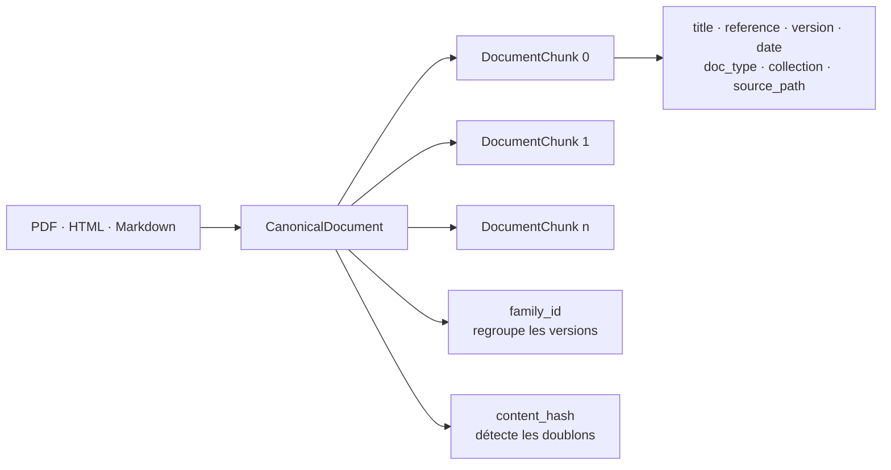

# 2 — Modèle des chunks et métadonnées

## Pourquoi ce modèle existe

Une réponse RAG doit rester reliée à une preuve identifiable. Les PDF, pages HTML et fichiers
Markdown produisent donc le même `CanonicalDocument`, puis chaque segment devient un
`DocumentChunk` qui recopie les métadonnées nécessaires à la citation et au filtrage.

## Contrat du document canonique

| Champ | Rôle |
|---|---|
| `doc_id` | identifiant stable d’une version documentaire |
| `family_id` | groupe les versions d’un même document métier |
| `title` | titre rendu dans la citation |
| `reference` | référence produit, par exemple `REF-8842` |
| `version` | version documentaire |
| `date` | date rendue dans la citation |
| `doc_type` | fiche, notice, procédure SAV ou note interne |
| `collection` | périmètre utilisé par la matrice d’accès |
| `source_path` | localisation de la preuve |
| `content_hash` | détection des doublons exacts normalisés |
| `is_primary` | indique la version principale de la famille |

Le chunk ajoute `chunk_id`, `chunk_index` et `text`, tout en conservant les champs documentaires.
Ainsi, une recherche ne perd ni la version, ni la référence, ni la collection autorisée.

## Décisions d’implémentation

- `ingest/parsers.py` isole les différences de formats mais produit un contrat unique.
- `ingest/catalog.py` élimine les doublons par hash et conserve l’historique des versions.
- `ingest/chunking.py` découpe par blocs avec chevauchement borné et identifiants déterministes.

### La granularité, chiffrée

Le brief demande explicitement : *« quelle granularité de chunk pour des fiches techniques ? »*

| Paramètre | Valeur | Pourquoi |
|---|---|---|
| Taille visée | **650 caractères** | assez pour qu'un paragraphe technique garde son sens, assez court pour qu'un passage cité reste lisible dans une réponse |
| Chevauchement | **100 caractères**, borné au quart de la taille | une phrase coupée en deux reste retrouvable des deux côtés |
| Découpage | **par blocs**, jamais au milieu d'un paragraphe | un tableau ou une liste de fiche technique perd son sens s'il est coupé |

**Mesuré sur le corpus livré** : **520 chunks**, taille minimale 170, **médiane 430**,
maximale 650 caractères.

> Un chunk plus gros diluerait la référence produit parmi d'autres ; un chunk plus petit
> perdrait le contexte qui rend la phrase citable.
- `ingest/pipeline.py` orchestre le tout et écrit un manifeste mesurable.
- `retrieval/service.py` filtre la collection **avant** la sélection des preuves.

## Preuve actuelle

Le dernier manifeste versionné conserve les nombres utiles sans exposer un chemin utilisateur :
400 fichiers examinés, 391 documents indexés, 9 doublons ignorés, 315 familles et 520 chunks.
