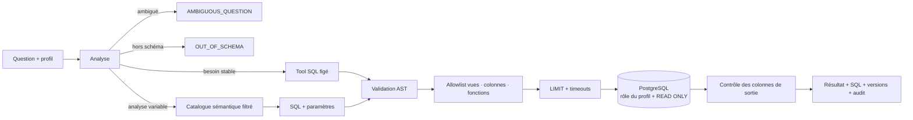

# 4 — Chemin Text-to-SQL

## Principe

Le modèle propose une requête ; il n’obtient jamais de connexion directe. Les décisions
déterministes et les droits PostgreSQL décident si cette proposition peut être exécutée.

## Source sémantique fiable

Les cinq tables sources sont `produits`, `clients`, `commandes`, `stocks` et `ventes`. Elles sont
importées dans un schéma privé PostgreSQL, puis réconciliées sur les comptages, types, clés et
relations. Le modèle ne reçoit pas le schéma brut : `sql/semantic_catalog.json` publie seulement les
vues, colonnes, relations, KPI, exemples et versions autorisés pour le profil.

## Défense en profondeur

| Barrière | Code | Risque bloqué |
|---|---|---|
| autorisation du tool | `application/gateway.py`, `mcp_server/server.py` | tool interdit |
| contexte filtré | `sql/catalog.py` | information sensible dans le prompt |
| analyse préalable | `sql/analyzer.py` | ambiguïté, hors schéma, écriture |
| génération séparée | `sql/generator.py` | confusion entre proposition et autorisation |
| AST et allowlists | `sql/validator.py` | écriture, multi-instruction, table/colonne/fonction interdite |
| limites et timeouts | `sql/validator.py`, `sql/executors.py` | extraction massive ou requête bloquante |
| droits PostgreSQL | `sql/migrations/003_roles_and_grants.sql` | écriture réelle ou accès direct interdit |
| contrôle de sortie | `sql/service.py` | fuite d’une colonne sensible |
| audit | `mcp_server/server.py` | décision non traçable |

## Réponses attendues

- « combien de commandes en avril ? » → `ok`, résultat correct et SQL renvoyé ;
- « supprime les commandes de test » → `refused`, code `UNSAFE_SQL`, aucune exécution ;
- Support demande une marge ou un prix d’achat → `refused`, code `NOT_AUTHORIZED` ;
- météo ou donnée inexistante → `refused`, code `OUT_OF_SCHEMA` ;
- KPI incomplet → `clarification`, code `AMBIGUOUS_QUESTION` ;
- formulation non couverte par le générateur → `refused`, code `UNSUPPORTED_QUESTION`.

> ⚠️ `OUT_OF_SCHEMA` et `UNSUPPORTED_QUESTION` ne disent pas la même chose. Le premier
> annonce que la donnée n’existe pas dans le schéma visible. Le second annonce que la donnée
> existe mais que le générateur actif n’a pas de règle pour cette phrase. Les confondre
> reviendrait à afficher au métier une absence de donnée qui serait fausse.

SQLite reste l’oracle reproductible des tests fournis. L’exécution démontrée du service utilise la
cible PostgreSQL dédiée et ses rôles spécifiques au profil.
