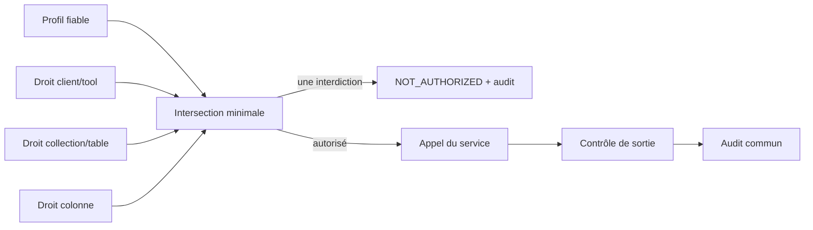

# 5 — Matrice d’accès

La matrice est un **tableau de droits**. Le flux d’enforcement explique ensuite où ces droits sont
appliqués. Les deux notions ne doivent pas être confondues.

## Profil × tool

<!-- GENERE:matrice-tools:debut — ne pas éditer à la main, voir scripts/generer_docs_matrice.py -->
> 🔒 Bloc **généré** depuis `application/access_policy.json`.
> Le modifier ici n'a aucun effet sur le code : modifier la politique, puis relancer
> `uv run python scripts/generer_docs_matrice.py`.

| Profil | `answer_question` | `search_docs` | `get_document` | `list_sources` | `ask_database` | `get_schema` | `check_stock` | `order_status` |
|---|:---:|:---:|:---:|:---:|:---:|:---:|:---:|:---:|
| Support client | ALLOW | ALLOW | ALLOW | ALLOW | ALLOW | DENY | ALLOW | ALLOW |
| Commercial | ALLOW | ALLOW | ALLOW | ALLOW | ALLOW | ALLOW | ALLOW | ALLOW |
| Développeur / IDE | DENY | ALLOW | ALLOW | ALLOW | DENY | ALLOW | DENY | DENY |
<!-- GENERE:matrice-tools:fin -->

## Profil × collection documentaire

<!-- GENERE:matrice-collections:debut — ne pas éditer à la main, voir scripts/generer_docs_matrice.py -->
> 🔒 Bloc **généré** depuis `application/access_policy.json`.
> Le modifier ici n'a aucun effet sur le code : modifier la politique, puis relancer
> `uv run python scripts/generer_docs_matrice.py`.

| Collection | Support client | Commercial | Développeur / IDE |
|---|:---:|:---:|:---:|
| `fiches_techniques` — Fiches techniques produit | ALLOW | ALLOW | ALLOW |
| `notices` — Notices d'utilisation | ALLOW | ALLOW | ALLOW |
| `procedures_sav` — Procédures SAV | ALLOW | ALLOW | ALLOW |
| `notes_internes` — Notes internes — commerciales et tarifaires | DENY | ALLOW | ALLOW |
<!-- GENERE:matrice-collections:fin -->

## Profil × ressource SQL

| Ressource | Support | Commercial | Developer / IDE |
|---|:---:|:---:|:---:|
| produits | ALLOW, sauf colonnes sensibles | ALLOW | schéma seulement |
| stocks | ALLOW | ALLOW | schéma seulement |
| commandes | ALLOW | ALLOW | schéma seulement |
| clients | ALLOW | ALLOW | schéma seulement |
| ventes | DENY | ALLOW | schéma seulement |
| produits.prix_achat_ht | DENY | ALLOW | définition seulement |
| produits.marge_pct | DENY | ALLOW | définition seulement |
| ventes.marge_ht | DENY | ALLOW | définition seulement |

## Calcul et enforcement

La même politique est appliquée :

1. au catalogue présenté au client ;
2. à chaque appel ;
3. dans le service RAG ou SQL ;
4. à la sortie ;
5. dans le journal.

Depuis le 2026-09-04, le catalogue **annoncé** est filtré par profil (`mcp_server/server.py:62`)
**et** chaque appel est réautorisé (`mcp_server/server.py:108`). Les deux barrières existent : la
première est une commodité pour le client, la seconde est la sécurité — un tool absent du
catalogue reste refusé et journalisé s'il est appelé quand même.

En revanche, **l’identité portée par un token Keycloak reste à industrialiser** : le profil vient
de `SORABEL_PROFILE`, une variable d’environnement du processus. Il ne faut pas l’annoncer
comme terminé.

## Erreurs et comportement du client

| Code | Sens | Réaction attendue |
|---|---|---|
| `OUT_OF_CORPUS` / `hors_corpus` | preuve documentaire insuffisante | afficher l’absence de réponse |
| `OUT_OF_SCHEMA` | donnée absente du schéma visible | expliquer la limite |
| `UNSUPPORTED_QUESTION` | donnée présente, mais formulation non couverte par le générateur actif | proposer de reformuler |
| `AMBIGUOUS_QUESTION` | critère métier manquant | demander une précision |
| `NOT_AUTHORIZED` | tool ou ressource interdit | afficher un refus neutre |
| `UNSAFE_SQL` | SQL non conforme | ne rien exécuter |
| `EXECUTION_ERROR` | incident contrôlé | afficher le message et le `request_id` disponible |

Le client est l’application consommatrice : interface Web, bot, IDE ou script de démonstration.
Une erreur ne doit jamais être repassée au LLM comme si elle constituait une donnée métier.
